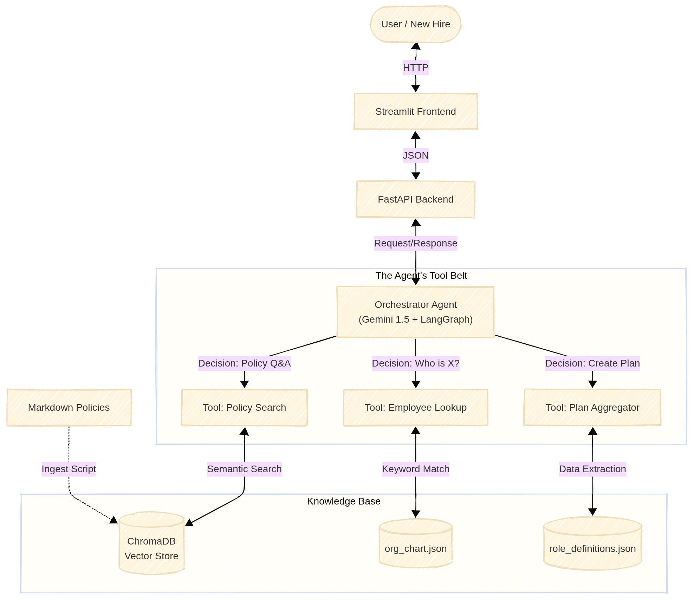

# Nebula - AI Onboarding Assistant

An Agentic RAG system designed to help new hires navigate company policies, roles, and workflows.

## 🏗 System Architecture

The system follows a **Perceive-Decide-Act** loop using a Graph-based Agent.





### Core Components
1.  **The Brain (Orchestrator):** Built with **LangGraph** and **Google Gemini 1.5 Flash**. It routes user intents to the correct specific tool.
2.  **The Memory (Knowledge Base):**
    * **Unstructured:** Company policies (Markdown) stored in **ChromaDB** (Vector Store).
    * **Structured:** Employee & Role data (JSON) accessed via Python lookups.
3.  **The Interface:**
    * **Backend:** **FastAPI** serves the agent logic via REST.
    * **Frontend:** **Streamlit** provides a chat interface.

## 🚀 Quick Start
1. Initialize the project:
   ```bash
   #from the root directory
   # Make the script executable
    chmod +x ./scripts/init.sh
   ./scripts/init.sh
   ```
2. Add your GOOGLE_API_KEY to .env

---
## 📂 Project Structure

The repository is organized into a modular architecture:

```text
nebula-onboarding-v1/
├── backend/                # FastAPI Application logic
├── rag_engine/             # Agent & Ingestion logic
├── data_seed/              # Synthetic Knowledge Base
├── frontend/               # Streamlit UI
├── tests/                  # Test Suite
├── scripts/                # Shell scripts
└── requirements.txt        # Project dependencies